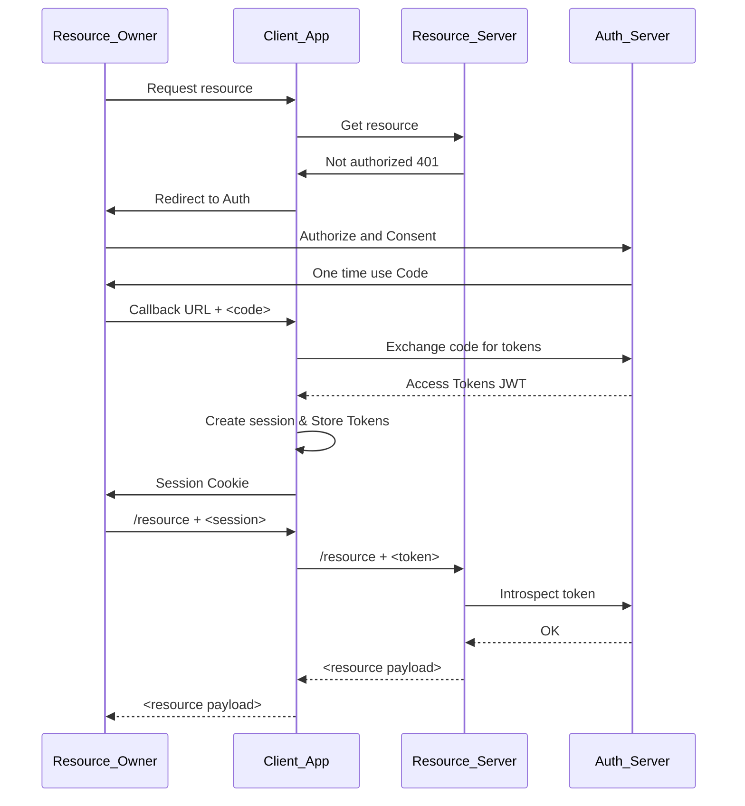
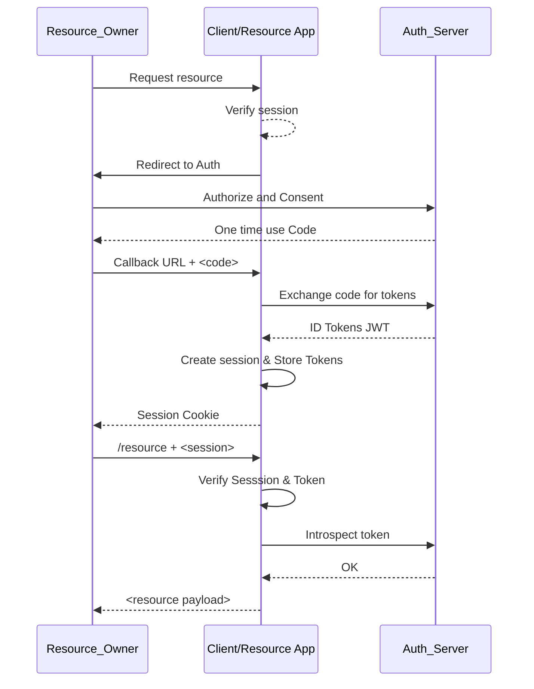

This repository's purpose is to confire OAUTH2 and OpenID Connect client / resource etc in order to show how they work as an exercise.

The Identity Provider is a Keycloak instance running in a docker container and configured using `tofu`. Keycloak config files are found under `infra` directory.

## Resource Server
The resource server is an Expressjs API that returns a hard-coded list of agenda items and also performs token validation and introspection with Keycloak.

The resource server is found under `resource_server`

## App Server

The app server serves a very simple web application, using Express js and Handlebar templates.
It exposes all the required pages and callback endpoints and manages the required redirects to the IdP (Keycloak).

The /agenda endpoint will call the `resource_server` with an access_token to show the user's agenda.

The app server is found under `server`

### Session Management

The authentication flow used is "code flow", so the JWT tokens are stored in the backend and an HTTPOnly session cookie is sent to the client (browser).
The session store on the backend is a very simple JSON file containing the sessionid and a JSON document with the various tokens.

## OAuth2

## OIDC

