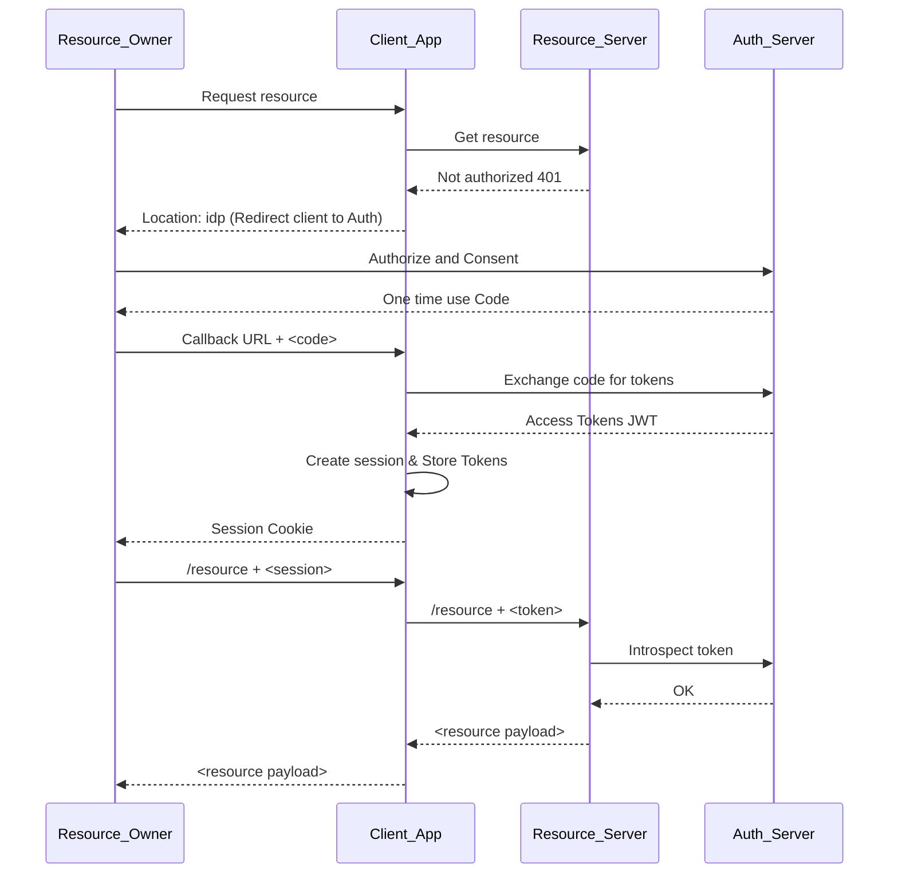
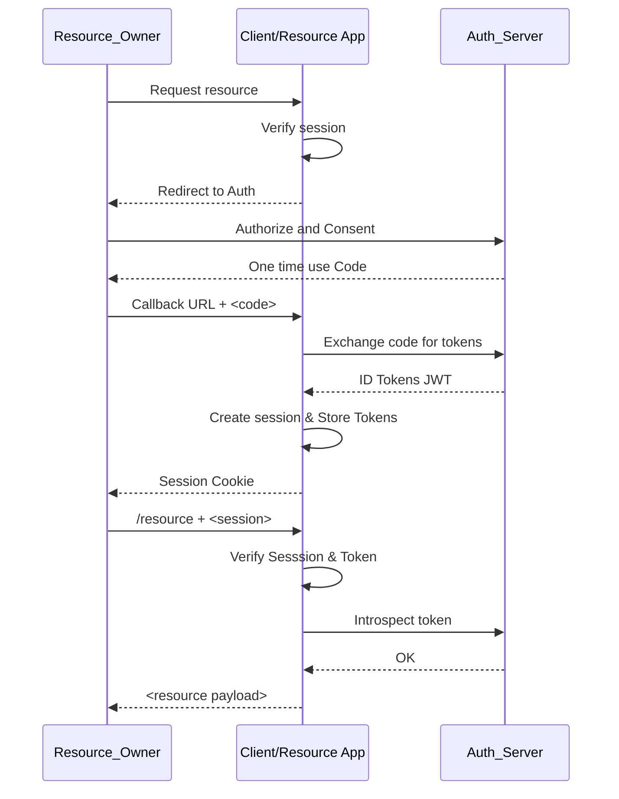

# OAUTH Exercise

This project shows how both OAUTH2 and Open ID Connect work in practice and what are the differences between the two.
It is intended to be used as a Workshop / Playground for tinkering and debugging the interaction between the various actors in an OAuth2 scenarios.

## Requirements

- Docker
- Configure /etc/hosts with
    ```
    127.0.0.1 localhost client-app idp idp-resource
    ```
- Node / npm

## Quick Access URLs 

The following URLs should be properly resolved (check /etc/hosts)

- http://idp:8080/admin/master/console/
- http://idp-resource:8080/
- http://client-app:3000/
- http://agenda-app:3001/agenda
- http://contacts-app:3002/contacts

## Authorization Server

The `Authorization Server / Identity Provider` role is played by a Keycloak instance running in a docker container and configured using `tofu`. Keycloak config files are found under `./authorization/` directory.

## Resource Server

The `Resource Server` is an Expressjs API that returns a hard-coded list of agenda items and also performs token validation and introspection with Keycloak.

The resource server is found under `resources/*`.

## Client / App Server

The `Client` is a server that provides a very simple web application, using Expressjs and Handlebar templates.
It exposes all the required pages and callback endpoints and manages the required redirects to the IdP (Keycloak).

The /agenda endpoint will call the `agenda_server` with an access_token to show the user's agenda.

The app server is found under `clients/client_app`

## Session Management

The authentication flow used is "code flow", so the JWT tokens are stored in the backend and an HTTPOnly session cookie is sent to the client (browser).

The session store on the backend is a very simple JSON file containing the session id and a JSON document with the various tokens.

## Client Scopes

A custom `agenda.read` scope is created on the `Authorization Server` to illustrate how scoped `access_tokens` work.

## Chapter 01 - Initial Scenario

The initial scenario presents a WEB application called "client-app" that shows a simple web page and a button, allowing to fetch the user's agenda.

The second application called "agenda-app" exposes only a REST endpoint, that is consumed by the client-app.

At this point there is no authorization of any kind.

## Chapter 02 - Adding a simple token check

In the second part of the exercise we will add a simple verification of the presence of a JWT token on the agenda-app.
At this point we will only check if there is a token and return 401 if not any. No real validation is done on the resource server for now.

Next we need to test the client-app and make sure that it properly displays an error message when trying to get the agenda.

After this we proceed with adding Keycloak and its configuration, allowing to obtain an access token for the client-app.  
The token is stored in-memory as a simple field on the client-app for now.

Workshop Steps:

- Add a token verifier function in token.js
- Verify agenda returns 401
- Add Keycloak instance via docker compose
- Add Keycloak configuration via terraform
- Show config.js
- Add redirect to auth in client_app.js
- Add /callback and save token
- Test agenda in WEB

### 03 - Adding a session

We have illustrated that tokens should not be stored in the WEB Browser, but have not addressed the issue of how to properly reuse them.  
To do so we will now add a simple session storage that creates and writes the session into a JSON file.

We also configure an HTTPOnly session cookie returned to the client-app (browser) and we start reusing the tokens we have stored in the session.

Workshop Steps:
- Add a session store that saves to file - session.js
- Add a client_app.use middleware to create the session
- Use token from session when calling agenda

### 04 - Add logout

After the session is added, we will run into a slight inconvenience while testing, and this is related to the fact that Keycloak also keeps a session on its own.  
We need to add a Logout button, that will call the special Keycloak logout endpoint and will also clean our local session.

Workshop Steps:
- Show that removing session cookie is not enough
- Add /logout button
- Add logout callback

### 05 - Token Validation and Scope

We now go back to our resource server (agenda-app) and implement a real token validation, using available libraries in offline mode.  

We also add a validation for a custom scope called "agenda.read".

To make "agenda.read" available we also need to modify Keycloak and add it as a configuration to the client app, as well as consent required = true etc.

We also will make sure we request this scope when redirecting from the client-app to the Keycloak server.

Workshop Steps:
- Add validation for scope in resources
- Check WEB
- Add scope to keycloak
- Add scope request in request

### 06 - Token Introspection

We continue by demonstrating how to delete a session on the Authorization Server. The fact that the session is gone however does not restrict us from continuing to use our token to acquire the agenda from agenda-app.

To remedy this problem we add a new token introspection validation.

Workshop Steps:
- Delete session in Keycloak
- Show we are still logged in the WEB
- Add token introspection
- Test logout

### 07 - Open Id Connect

Now that our application "speaks" OAuth2 with the resource server, let's add a general authentication for the client-app so that the entire app is protected.
To do this we use OpenID connect and create an app-wide session.

Workshop Steps:
- Add new realm in Keycloak
- Add redirect to auth in session check
- Refactor redirect to auth
- Handle callback

### 08 - Audience

To illustrate the proper use of the "aud" audience attribute in OAuth2 we will add a new resource app called contacts-app.
This app will also have the "agenda.read" scope and provides a list of contacts with their respective agendas.

We can then illustrate how we can use a token obtained from the "agenda-app" to access the "calendar-app" and explain why this is an issue.

We proceed to solve the problem by configuring an audience in Keycloak and validating it on the resource-app end.

Workshop Steps:
- Add a new resource /contacts
- Add a new Keycloak client for contacts
- Use token from /agenda to access /contacts
- Add audience verification in contacts_app.js
- Add audience to Keycloak
- Verify WEB

### 09 - Refresh Token

For security reasons the access token has a short lifespan, but to keep the user's experience smooth let's add a refresh token function for the agenda.

Workshop Steps:
- Set token expiration to 5s in Keycloak
- Test expiration in WEB
- Add token refreshed
- Test expiration in WEB

### 10 - Proof of Key Code Exchange & State

We have implemented the Code Exchange Flow in our previous chapters, and we have learned how to properly store our JWT tokens on the backend session to keep them safe. However, there is another small loophole we need to address: what happens if someone intercepts out code after the authentication process and uses it to obtain a JWT token without our consent.
To remedy this issue we need to implement the PKCE (Proof of Key Code Exchange)

To demonstrate the issue we will open a new browser with a "bad user" logged in. Then we will intercept the callback request of the regular user, replay this request in the bad user's session and observe that we are now logged in as the regular user (session high-jacking).

We will also add the "state" parameter for additional layer of protection against CSRF attacks.

Workshop Steps:

- Open a new browser and log-in as "app_user" 
  `chromium --proxy-server="socks5://127.0.0.1:8099`
- Run a proxy
  `mitmproxy --intercept "~u client-app:3000/callback" --mode socks5 --listen-port 8099`
- Try to login as the app user and copy the redirect URL
- Open another browser (without proxy) and login as "bad_user"
- Copy the redirect URL from the previous browser - session is high-jacked
- Add PKCE
- Add state

### 11 - Role Based Access Control (Keycloak)

Token scopes are useful to say what a client (an app) can request from a resource server, but if we wish to handle user-level permissions on our website it is often useful to use RBAC roles.
To illustrate RBAC (non-standard OAuth2 part of Keycloak) we will create a new role `backoffice_admin` and a new client-app endpoint `/backoffice`.
A simple check on the Expressjs server will refuse all requests that do not include the appropriate role.

To test we will add a new user called `app_admin`.

### 12 - Service Account (Client Credentials Grant)

We saw how to delegate access as a user on the behalf of another application using OAuth2 and scopes, but sometimes it is necessary to make a request to a resource server from another server, without having a user identity involved in the process.
This can be done using a `service account` in Keycloak's terms or also known as `Client Credentials Grant` where we request a token directly as an OAauth 2 client.

To illustrate we will add an `/server-to-server` endpoint that request's the client's agenda using Client Credentials Grant.

## Diagrams

### OAuth2



### OIDC



## TODO

